# Pippin 🌱

**The ADHD coach that can actually see your life, on your terms.**

Most ADHD apps only know what you remember to tell them, which is exactly the problem. Pippin connects to **your own
AI agent** (such as [Hermes Agent](https://github.com/NousResearch/hermes-agent)), and that agent can read whatever you
choose to give it: your inbox, your calendar, your bank balance, your sleep and steps. So your goals can be about
real life, and they can tick themselves off:

| You set a goal | Your agent checks… | …using a tool you connected |
|---|---|---|
| Keep a cushion before payday | "Is my current account above £200?" | Your bank, via Firefly III or an open-banking sync |
| Don't let email pile up | "Have I replied to everything in my inbox older than 2 days?" | Gmail (or any mailbox your agent can read) |
| Sleep properly | "Did I sleep at least 7 hours last night?" | Garmin, Oura, Whoop, Apple Health or Fitbit via [Open Wearables](https://github.com/the-momentum/open-wearables) |
| Move a bit | "Have I done 6,000 steps today?" | The same wearable link |
| Don't miss the school stuff | "Is there anything from school in my inbox that needs a reply?" | Gmail |
| Pay the card on time | "Has the credit card been paid this month?" | Your bank |

When it's true, the goal ticks and your sprig gets the energy. When it isn't, **nothing happens**: no red mark, no
nagging. And "plan my day" builds your plan from what's actually in your calendar and inbox today.

**You decide how much it sees.** Give the agent nothing and Pippin still works as a complete companion. Give it email
only, or everything. The access lives in *your* agent, with *your* credentials, on *your* server. Pippin never
holds your bank or email passwords; it asks the agent read-only questions. See [docs/AGENT.md](docs/AGENT.md).

### And the rest of the companion
You hatch a small moss creature called a *sprig*. Small acts of self-care give it energy. When its energy bar is
full it goes off on an adventure and comes home with a little story. It never gets sad, sick or smaller because
you were away. Around it:

- **A private ADHD coach** that makes if-then plans, breaks tasks into two-minute steps, keeps one inbox and nudges
  you at the right moment. Run it on **your own model (Ollama)** or bring an API key for **ChatGPT, Claude, Gemini
  or OpenRouter**. Crisis handling is code, not a prompt.
- **Habits** scored on strength rather than streaks. A missed day dents the score; it doesn't wipe your progress.
- **A sobriety tracker** for alcohol and 21 other substances and behaviours. The headline number is *total free
  days*, which never goes down. A slip opens a short debrief, not a reset.
- **Monthly GAD-7 / PHQ-9 / WHO-5** with trends, and a **PDF to share with your GP or therapist**.
- **Everyday AI chat** with optional web search, kept separate from the coach.
- **Fitness (optional):** everything your **Garmin** shows (sleep stages, HRV, stress, Body Battery, heart rate,
  blood pressure, steps, readiness, VO₂ max) with 30-day trends, plus a **food diary with meal plans** and a
  **workout log with saved routines**. Numbers can be hidden for anyone who does better without them.

It runs on your server, works offline, and installs as an app on Android, iPhone and desktop.

<p align="center">
  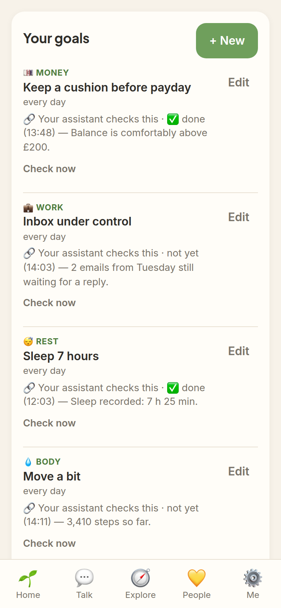
  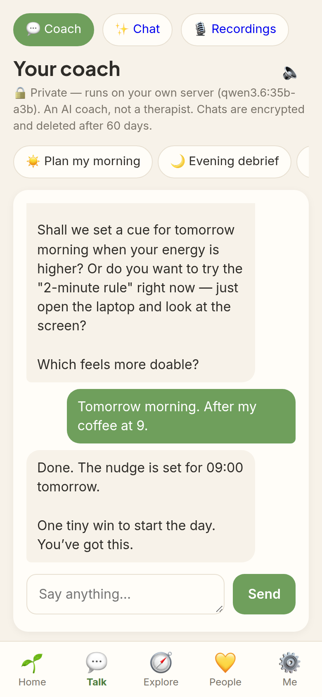
  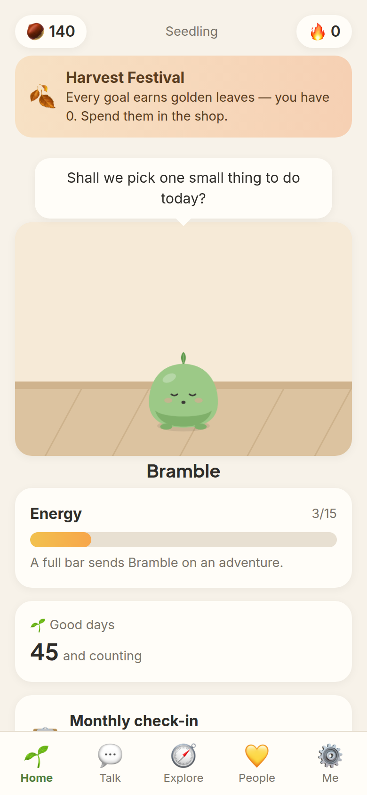
  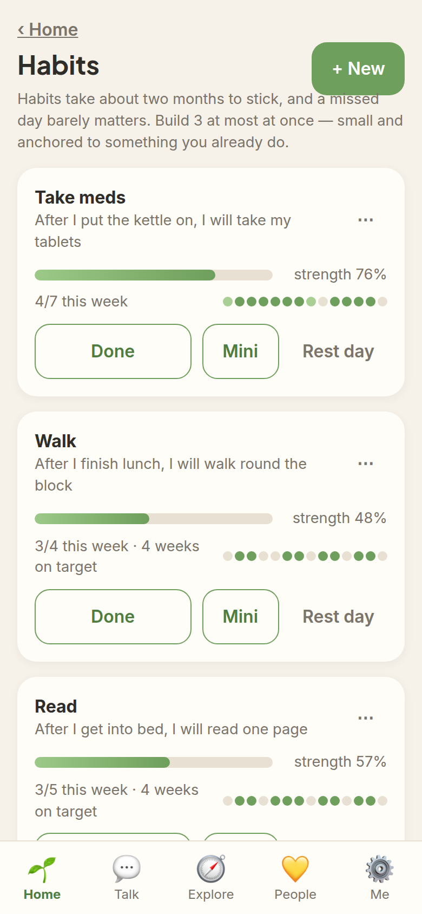
</p>
<p align="center">
  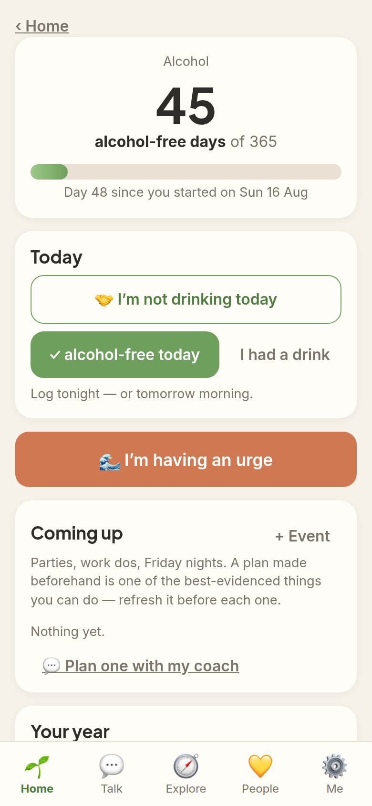
  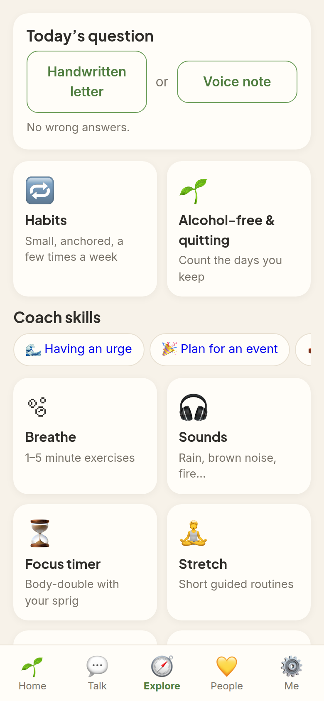
  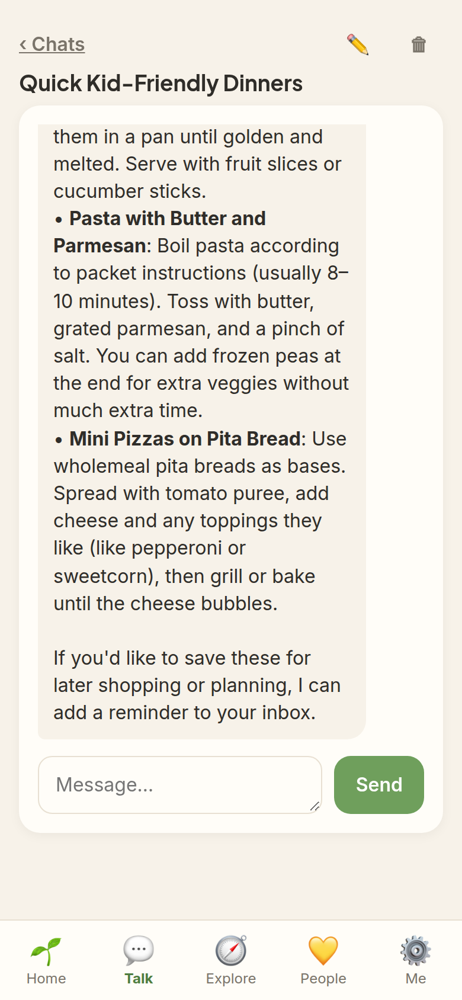
  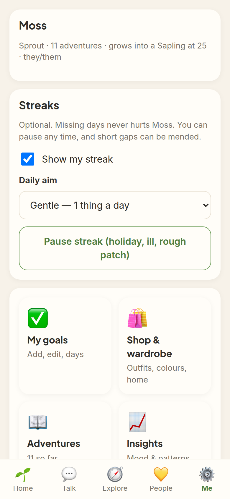
</p>
<p align="center">
  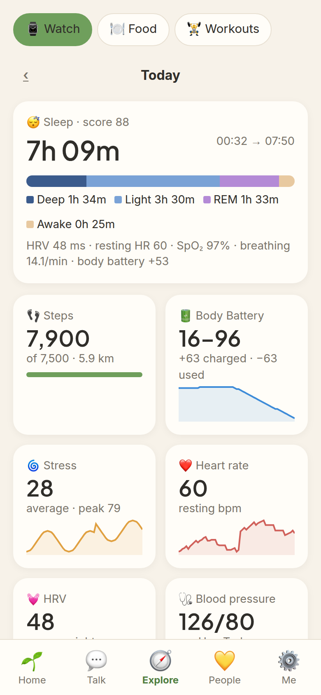
  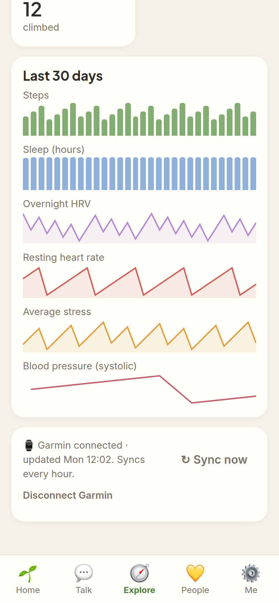
  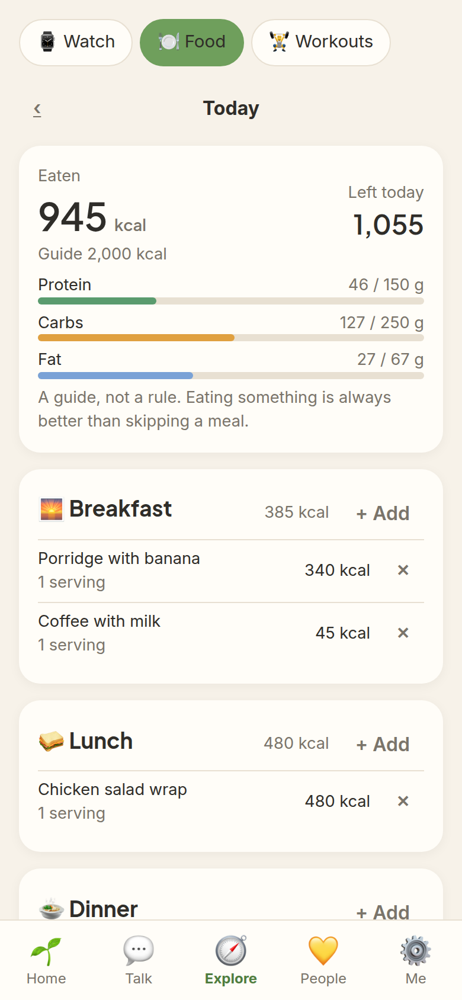
  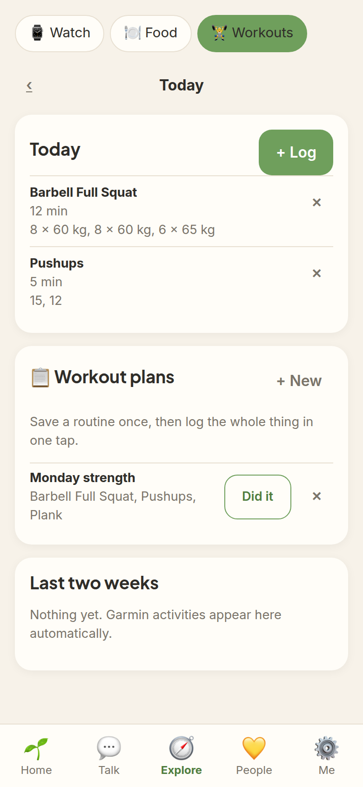
</p>
<p align="center"><sub>Screenshots use a demo account with made-up data.</sub></p>

> **Not therapy, not a medical device.** Pippin is a self-help wellbeing tool for adults. Questionnaires are
> screening tools, not diagnoses. If you're struggling, speak to your GP. **In crisis (UK):** Samaritans
> 116 123 · text SHOUT to 85258 · emergency 999. Elsewhere: [findahelpline.com](https://findahelpline.com).

**Contents:** [Why](#why-another-adhd-app) · [Features](#features) · [Install](#install) · [Choosing an AI](#choosing-an-ai)
· [Connecting your agent](#connecting-your-agent) · [Fitness](#fitness-garmin-food-and-workouts) · [HTTPS and your phone](#https-and-installing-on-your-phone)
· [Updating and backups](#updating-and-backups) · [Configuration](#configuration) · [Safety and privacy](#safety-and-privacy)

## Why another ADHD app?
There are good pet apps (Finch), good ADHD planners (Tiimo, Sprout), good sobriety apps (I Am Sober, Reframe) and
good habit trackers (Loop). They all share two limits:

1. **They're blind.** They only know what you type in, and ADHD is the condition of forgetting to type it in. None
   of them can see that the bill went out, the email is three days old, or you slept four hours.
2. **They're someone else's cloud.** Your mental-health data, often with a paid AI on top.

Pippin is:

- **Connected:** goals and plans built on your real inbox, calendar, money and health, through an agent you control.
- **Private:** self-hosted, encrypted at rest, no telemetry. With a local model, nothing leaves your network.
- **Forgiving by design:** no decay, no lost progress, no guilt copy, no streak resets used as punishment.
- **One place:** the pet keeps you coming back, and the tools are there when you do.
- **Free:** no ads, no paywalled self-care. Cosmetics are earned in-app.

## Features
The short version. The full list is in [FEATURES.md](FEATURES.md).

| | |
|---|---|
| 🌱 **Companion** | Hatch and name a sprig; 5 growth stages; adventures with stories; outfits, furniture and room themes; seasonal events; it never decays |
| 🔗 **Agent-linked goals** | Goals your own agent checks and ticks: money, email, calendar, sleep, steps, whatever its tools can read; "plan my day" from your real calendar and inbox |
| ✅ **Goals and check-ins** | Tiny self-care goals with two-minute first steps; morning and evening mood check-ins; insights on what lifts your mood |
| 💬 **Coach** | Morning plan, evening debrief, weekly review, can't-start, thought check, before-a-hard-thing, pause-before-acting; if-then plans with nudges; one inbox; local voice |
| 🔁 **Habits** | "After I…, I will…" habits; X days a week; habit strength (Loop formula); Done / Mini / Rest day from the notification; max 3 building at once |
| 🌊 **Quitting** | 22 categories; total free days that never go down; lapse debrief; urge surfing; event plans; money and units saved; per-substance safety rules and UK helplines |
| 📋 **Check-ins for your GP** | Monthly GAD-7, PHQ-9 and WHO-5 with trends; a PDF report where you choose the period and sections |
| ⌚ **Fitness** (optional) | Garmin sleep, HRV, stress, Body Battery, heart rate, BP, steps, readiness, VO₂ max with 30-day trends; food diary, Open Food Facts search, quick add, meal plans, hide-the-numbers; workouts with sets and saved routines |
| 🧘 **Tools** | Breathing, generated ambient sounds, focus timer with your sprig as a body double, stretches, reflections, multi-day journeys |
| ✨ **Chat** | Separate everyday conversations, optional web search with sources |
| 👪 **Household** | Several people on one server, each private; friends see your sprig and shared goals, never your check-ins |
| 📱 **App** | Installable PWA, works offline, push nudges with action buttons and a daily cap, PIN lock, export or delete everything |

## Install
Pick one. All three end with Pippin at `http://localhost:8910`. The first screen asks for your name, a PIN and the
setup code that the setup script prints.

### Option 1: Docker on Linux or macOS (recommended)
You need [Docker](https://docs.docker.com/engine/install/) with the Compose plugin, and `git`.
```bash
git clone https://github.com/tbusiness25/pippin.git
cd pippin
./scripts/setup.sh            # asks which AI to use, writes .env with fresh secrets
docker compose up -d --build
```
Check it's healthy with `docker compose ps`, and read the logs with `docker compose logs -f app`.

### Option 2: Windows with WSL 2
1. In PowerShell **as Administrator**: `wsl --install -d Ubuntu`, then restart and create your Linux user.
2. Install **[Docker Desktop](https://docs.docker.com/desktop/setup/install/windows-install/)**. In *Settings →
   Resources → WSL integration*, turn it on for Ubuntu. (Or install Docker Engine inside Ubuntu instead.)
3. Open **Ubuntu** from the Start menu and run the Option 1 commands. Clone into your Linux home folder
   (`~/pippin`), **not** `/mnt/c/…`: it's much faster and avoids file-permission problems.
4. Open `http://localhost:8910` in your Windows browser. WSL 2 forwards the port automatically.

**Using Ollama on Windows?** Install the Windows version of Ollama and pick "Ollama" in the setup script. The
container reaches it at `host.docker.internal`. If it can't connect, set the environment variable
`OLLAMA_HOST=0.0.0.0` in Windows, restart Ollama, and allow it through the firewall.

**Keeping it running:** Pippin restarts with Docker Desktop. Turn on *"Start Docker Desktop when you sign in"* so
nudges still arrive after a reboot. WSL stops when nothing is using it, and Docker Desktop keeps it awake.

### Option 3: Linux without Docker
You need **Node.js 20+** and **PostgreSQL 14+**. On Debian or Ubuntu:
```bash
sudo apt install -y postgresql git curl
curl -fsSL https://deb.nodesource.com/setup_20.x | sudo -E bash - && sudo apt install -y nodejs

git clone https://github.com/tbusiness25/pippin.git && cd pippin
./scripts/setup.sh                     # answer "n" to "Run with Docker?"

# create the database with the password the script put in .env
source <(grep -E '^(DB_NAME|DB_USER|DB_PASSWORD)=' .env)
sudo -u postgres psql -c "CREATE USER $DB_USER WITH PASSWORD '$DB_PASSWORD';"
sudo -u postgres psql -c "CREATE DATABASE $DB_NAME OWNER $DB_USER;"
sudo -u postgres psql -d "$DB_NAME" -c "CREATE EXTENSION IF NOT EXISTS pgcrypto;"

npm install --omit=dev
PORT=8910 npm start                    # tables are created on first start
```
To run it as a service, save this as `/etc/systemd/system/pippin.service` (change the user and path):
```ini
[Unit]
Description=Pippin
After=network-online.target postgresql.service

[Service]
User=youruser
WorkingDirectory=/home/youruser/pippin
Environment=PORT=8910 SW_VERSION=1
ExecStart=/usr/bin/node server.js
Restart=on-failure

[Install]
WantedBy=multi-user.target
```
Then run `sudo systemctl enable --now pippin`. Without Docker, set `AI_BASE_URL=http://localhost:11434/v1` for Ollama
(the setup script does this for you).

## Choosing an AI
The coach, chat and adventure stories use one model, chosen with three settings in `.env`. The setup script
asks you; this is what it writes.

| You want | `AI_PROVIDER` | `AI_MODEL` (example) | `AI_API_KEY` | Privacy |
|---|---|---|---|---|
| **Free and private**, on your own computer | `ollama` | `qwen3:8b` · `llama3.1:8b` · `gemma3:12b` | — | 🔒 Nothing leaves your network |
| **ChatGPT** models | `openai` | `gpt-4.1-mini` | from [platform.openai.com](https://platform.openai.com/api-keys) | ☁️ Sent to OpenAI |
| **Claude** models | `anthropic` | `claude-sonnet-5-5` · `claude-haiku-4-5` | from [console.anthropic.com](https://console.anthropic.com/) | ☁️ Sent to Anthropic |
| **Gemini** | `gemini` | `gemini-2.5-flash` | from [aistudio.google.com](https://aistudio.google.com/apikey) | ☁️ Sent to Google |
| Lots of models, one key | `openrouter` | e.g. `anthropic/claude-sonnet-5.5` | from [openrouter.ai](https://openrouter.ai/keys) | ☁️ Sent to OpenRouter and the model's provider |
| **Any OpenAI-compatible server**: llama.cpp, LM Studio, vLLM, LocalAI, Jan… | `custom` | whatever the server calls it | if it needs one | Depends where it runs |

Examples:
```ini
# Ollama on the same machine (ollama pull qwen3:8b first)
AI_PROVIDER=ollama
AI_MODEL=qwen3:8b

# Ollama on another computer on your network
AI_PROVIDER=ollama
AI_MODEL=qwen3:14b
AI_BASE_URL=http://my-gpu-box.local:11434/v1

# Claude
AI_PROVIDER=anthropic
AI_MODEL=claude-sonnet-5-5
AI_API_KEY=sk-ant-...

# LM Studio's local server
AI_PROVIDER=custom
AI_BASE_URL=http://host.docker.internal:1234/v1
AI_MODEL=qwen3-8b
```
After changing `.env`, run `docker compose up -d` (or restart the service).

**Which model is good enough?** The coach uses tool calling, so pick a model that supports it. Locally, 8B models
work and 14–35B models follow the coach's rules noticeably better. Every cloud option above is capable.

**About privacy with cloud models:** your coach conversations, and the goals and check-ins the coach uses as
context, are sent to the provider. The app shows "(remote)" next to the model and tells you where your
conversations go. Crisis detection, the helplines and everything outside the AI features work the same either way.

**Mixing models** is possible: a local model for the coach and a cloud one for stories, for example. See
"Advanced" in [`.env.example`](.env.example).

## Connecting your agent
Optional, and the part that makes Pippin different. The full guide, with examples for email, banking and
wearables, is [docs/AGENT.md](docs/AGENT.md). In short:

1. Run an agent with an OpenAI-compatible API. [Hermes Agent](https://github.com/NousResearch/hermes-agent) is the
   tested one: turn on its API server (`API_SERVER_ENABLED=true`, `API_SERVER_KEY=…`).
2. Give **the agent** the tools you want Pippin to benefit from: Google Workspace for Gmail and Calendar, an
   [Open Wearables](https://github.com/the-momentum/open-wearables) MCP server for health data, your finance app's API
   for balances. Prefer read-only access everywhere.
3. Tell Pippin where it is:
   ```ini
   BRAIN=hermes                       # or BRAIN=agent for any other OpenAI-compatible agent
   HERMES_API_URL=http://hermes:8642/v1
   HERMES_API_KEY=your-api-server-key
   AGENT_SOURCES=Firefly III (bank balances), Open Wearables (sleep, steps)   # optional: what else to look at
   ```
4. In Pippin, edit a goal → **Let your assistant tick this** → write a yes/no question. It's checked about once an
   hour (`AGENT_CHECK_EVERY_MIN`), or straight away with **Check now**.

The coach conversation itself stays on the model you chose in [Choosing an AI](#choosing-an-ai). The agent is only
asked for plans and for goal checks, and Pippin stores just its short answer, encrypted.

## Fitness: Garmin, food and workouts
Optional. It runs [SparkyFitness](https://github.com/CodeWithCJ/SparkyFitness) headless inside the stack: its
database and server are only reachable from Pippin, and Pippin has its own screens for it (*Explore → Watch / Food
/ Workouts*). Each person on your Pippin gets their own fitness account automatically. It adds about 600 MB of RAM.

**Turn it on:** answer "y" in `./scripts/setup.sh`, or add this to `.env` and run `docker compose up -d`:
```ini
COMPOSE_PROFILES=fitness
SPARKY_URL=http://sparky-server:3010
SPARKY_DB_PASSWORD=...         # openssl rand -hex 24
SPARKY_APP_DB_PASSWORD=...     # openssl rand -hex 24
SPARKY_ENCRYPTION_KEY=...      # openssl rand -hex 32
SPARKY_AUTH_SECRET=...         # openssl rand -hex 32
```
**Connect Garmin:** *Explore → Watch* → sign in with your Garmin Connect email and password (and the code Garmin
sends, if you use 2-step verification). The last 30 days come in straight away, then it syncs every hour. Your
password isn't stored; only Garmin's sign-in token is, encrypted. This uses an unofficial Garmin connection, the
same one SparkyFitness and many home projects use, so Garmin may occasionally ask you to sign in again. Garmin's
official API is only open to approved businesses.

**Other watches:** SparkyFitness can also sync Fitbit, Oura, Polar, Strava, Withings and others. Pippin's Watch
screen currently connects Garmin; others are on the [roadmap](ROADMAP.md).

**Agent-linked goals:** your agent can't see this data unless you give it access. The simplest way is to add
SparkyFitness' MCP endpoint (`/mcp`, with an API key) to your agent.

## HTTPS and installing on your phone
Installing as an app, notifications and the microphone all need **HTTPS**. Plain `http://localhost` works on the
computer running Pippin, but not from your phone. The easiest options:

- **[Tailscale](https://tailscale.com/)** (free, private): install it on the server and your phone, then run
  `tailscale serve --bg 8910`. Open the `https://<machine>.<tailnet>.ts.net` address on your phone.
- **Cloudflare Tunnel**: public HTTPS without opening ports. Put Cloudflare Access in front if it's on the internet.
- **A reverse proxy** such as Caddy (`pippin.example.com { reverse_proxy localhost:8910 }`), nginx or Traefik.

Then open the address on your phone and choose **Add to Home Screen** (iPhone: Share → Add to Home Screen;
Android: ⋮ → Install app). Turn on nudges in *Me → Nudges*.

**Don't expose Pippin to the internet without HTTPS**, and set `SETUP_CODE` (the setup script does) so nobody can
claim it before you do.

## Updating and backups
```bash
git pull
docker compose up -d --build                      # or: npm install --omit=dev && sudo systemctl restart pippin
```
Database changes apply automatically on start.

**Back up** two things:
- **The database:** `docker compose exec db pg_dump -U pippin pippin > pippin-$(date +%F).sql`
- **`DATA_KEY` from `.env`**, stored somewhere safe. Without it, encrypted chats and transcripts can't be read.
  There is no recovery, by design.

You can also export everything you've entered as JSON from inside the app (*Me → Privacy*).

## Configuration
Everything is in [`.env.example`](.env.example), with comments. Beyond the AI settings:

| Setting | What it does |
|---|---|
| `SETUP_CODE` | Required on the first-run screen |
| `APP_NAME` | Call your copy whatever you like |
| `TZ_DEFAULT` | Your time zone (nudges and "today" follow it) |
| `COACH_RETENTION_DAYS` | Coach conversations are deleted after this (default 60) |
| `CRISIS_RESOURCES_JSON` | Crisis lines for your country (defaults are UK) |
| `CHAT_WEB=true` + `SEARXNG_URL` | Lets everyday chat search the web through your [SearXNG](https://docs.searxng.org/). The coach never does |
| `WHISPER_URL`, `TTS_URL` | Local voice in and out (any OpenAI-compatible speech server) |
| `BRAIN=hermes` / `agent` | Connect your agent: plans from your real calendar and email, and goals it can tick ([guide](docs/AGENT.md)) |
| `AGENT_SOURCES` | Extra things the agent should look at when planning, e.g. your bank or wearable data |
| `AGENT_CHECK_EVERY_MIN` | How often agent-linked goals are checked (default 60) |
| `VAULT_HOST_DIR` | An Obsidian folder for notes you approve |
| `VOICE_NOTES_HOST_DIR` | A folder of transcribed voice notes to sort into reminders, memories and journal |
| `VOICE_FILE_INTO_FOLDERS`, `VOICE_KEEP_ALL_AUDIO` | File each note into a folder per category, and back up every recording's audio |
| `COMPOSE_PROFILES=fitness` | The fitness add-on: Garmin, food diary, meal plans and workouts ([above](#fitness-garmin-food-and-workouts)) |

## Safety and privacy
- [docs/SAFETY.md](docs/SAFETY.md): intended purpose, hazard log, red-team suite and regulatory position
- [PRIVACY.md](PRIVACY.md): what stays on your server and what can leave it (only things you turn on)
- [SECURITY.md](SECURITY.md): reporting vulnerabilities

The design is grounded in published research. The reports and their sources are in
[docs/research](docs/research/reports/).

## Status
Version 0.10 is an early public release, by one person. Everything listed works, but read
[docs/KNOWN_ISSUES.md](docs/KNOWN_ISSUES.md) before relying on it, and see the [roadmap](ROADMAP.md) and
[changelog](CHANGELOG.md).

UK-first: helplines, units and guidance are British. Country packs are welcome contributions.

## Contributing
Bug reports, safety reports and small PRs are very welcome. Start with [CONTRIBUTING.md](CONTRIBUTING.md) and
the [code of conduct](CODE_OF_CONDUCT.md).

## Licence
[AGPL-3.0](LICENSE). Use it, self-host it and change it freely. If you run a modified version as a service for
other people, you must share your changes. All art, sounds and text are original; "Finch" and other app names
mentioned belong to their owners and are used only for comparison.
